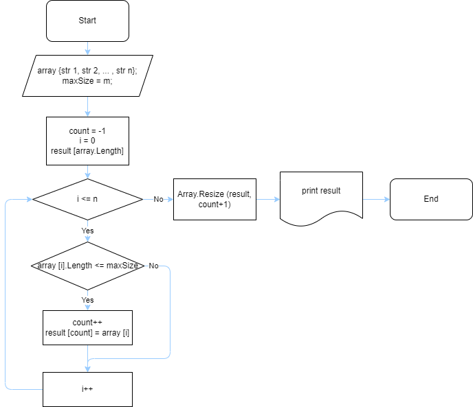

>Это репозиторий для итоговой проверочной работы по итогу первой четверти обучения на курсе "Разработчик" онлайн-школы GeekBrains.

# Описание задания

Задача алгоритмически не самая сложная, однако для полноценного выполнения проверочной работы необходимо:

1. Создать репозиторий на GitHub
2. Нарисовать блок-схему алгоритма (можно обойтись блок-схемой основной содержательной части, если вы выделяете её в отдельный метод)
3. Снабдить репозиторий оформленным текстовым описанием решения (файл README.md)
4. Написать программу, решающую поставленную задачу
5. Использовать контроль версий в работе над этим небольшим проектом (не должно быть так, что всё залито одним коммитом, как минимум этапы 2, 3, и 4 должны быть расположены в разных коммитах)

Задача: Написать программу, которая из имеющегося массива строк формирует новый массив из строк, длина которых меньше, либо равна 3 символам. Первоначальный массив можно ввести с клавиатуры, либо задать на старте выполнения алгоритма. При решении не рекомендуется пользоваться коллекциями, лучше обойтись исключительно массивами.

Примеры:

[“Hello”, “2”, “world”, “:-)”] → [“2”, “:-)”]

[“1234”, “1567”, “-2”, “computer science”] → [“-2”]

[“Russia”, “Denmark”, “Kazan”] → []

 

# Описание решения

1. Адрес репозитория в котором находится данное задание: 

[Репозиторий на GitHub](https://github.com/BLI3980/GB_1stQuarter_Testwork.git)

2. Блок-схема алгоритма данного задания:

3. Описание решения данного задания:

> 0. Создадим новый метод, который будет выполнять решение нашей задачи.
Метод в аргументах будет принимать некий строковый массив и число, задающее максимальную длину строковых элементов, которые будут записаны в новый строковый массив.

> 1. Заведем переменную (назовем ее **count**), которая будет увеличиваться на один, каждый раз, когда в ходе выполнения метода встретится элемент, отвечающий требованиям задачи. Данная переменная будет задавать индексы для элементов нового массива, куда будут складываться нужные элементы. Переменной зададим начальное значение **-1**, на тот случай, когда во входном массиве не будет элементов, отвечающих условию. В этом случае переменная не изменит своего значения на **0** или еще больше, и программа выдаст сообщение, что результирующий массив пуст.

> 2. Также создадим новый строковый массив, куда будут складываться элементы, отвечающие условию. Так как изначально неизвестно, сколько элементов во входом массиве отвечают условию, в качестве начального значения зададим размер нового массива равным входному массиву.

> 3. Для поиска элементов, отвечающих условию, с помощью цикла пройдемся по всему входному массиву и сравним длину каждого строкового элемента с требуемой длиной. В случае соответствия условию:
> - увеличиваем значение переменной на **1**;
> - записываем значение этого элемента в элемент результирующего массива с текущим значением индекса элемента, равным значению **count**.

> 4. После прохождения по всем элементам входного массива, избавимся от пустых мест в результирующем массиве, если таковые есть, с помощью системного метода Array.Resize. 
Так как значение **count** после завершения цикла будет равно индексу последнего элемента массива (кроме случаев, когда **count** неизменно остается равным **-1**), то размером результирующего массива будет **count+1**, так как размерность массива считается с **1**, в отличие от нумерации индексов в массиве, начинающихся с **0**.

> 5. Обозначим ситуацию, когда результирующий массив пуст, соответствующим сообщением в терминале.

> 6. Для удобства вывода элементов массива в терминале, создадим метод, проходящий по массиву и выводящий каждый элемент в терминал.

> 7. Зададим входной массив

> 8. Максимальный размер элементов для результирующего массива задан в условии задачи как **3**. Данная программа позволяет задавать различные значения максимального размера элементов с клавиатуры.

> 9. Результат программы выводится в терминал с поясняющим сообщением.

